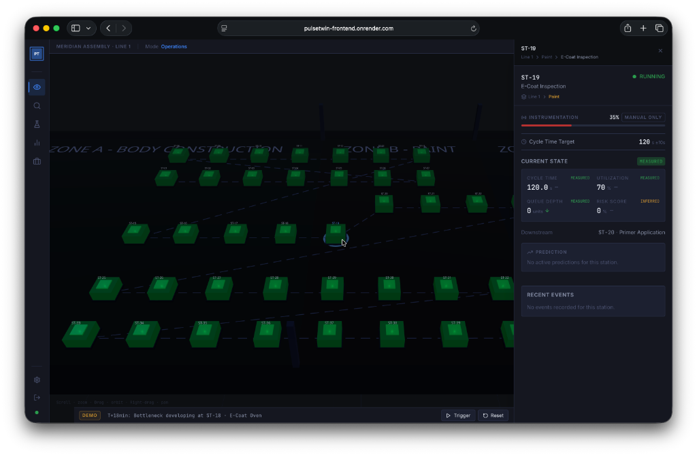
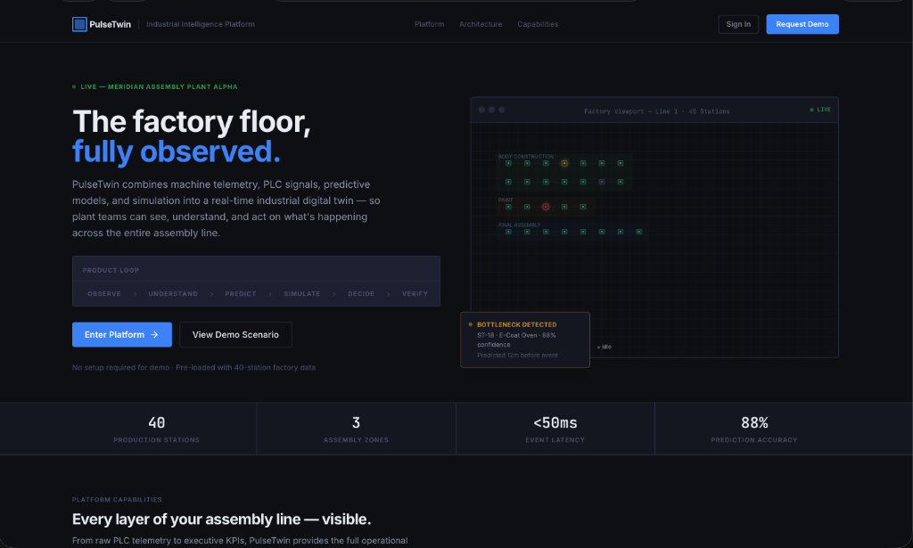
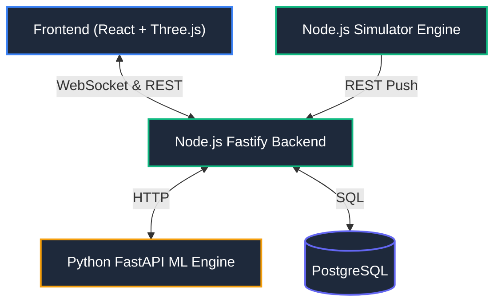
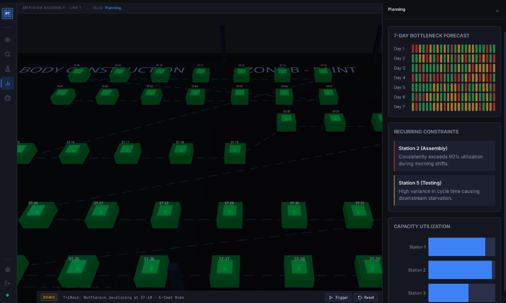
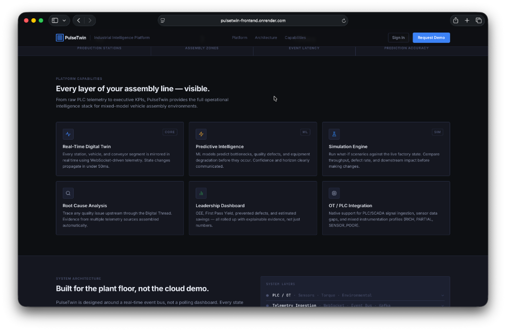

  <h1 align="center">PulseTwin | DigitalTwin.ai</h1>
  
  

    <strong>Accenture Innovation Challenge 2026 — Round 2 Finalist</strong>
  

  
  

    A predictive digital twin for hybrid assembly lines. Built to observe the present, understand anomalies, and predict bottlenecks before they stop production.
  

  

    
  

  

    
    
    
    
    
    
  

 

  

 

> **The Challenge:** Modern assembly lines are rarely perfectly instrumented. They are a messy patchwork of state-of-the-art robotics and decades-old legacy equipment. How do you build a digital twin when you don't have perfect data?

> **Our Solution:** **PulseTwin** bridges this gap. By combining real-time 3D spatial mapping with a hybrid machine learning engine, it takes sparse, uneven telemetry data and generates highly accurate predictive maintenance and bottleneck alerts. 

---

## ✨ Key Differentiators

  

 

| Feature | Description |
| :--- | :--- |
| 🏭 **Real-time 3D Factory** | An interactive WebGL (`Three.js`) visualization of a 40-station assembly line, built for high-performance spatial tracking. |
| 🧠 **Predictive AI Engine** | Machine learning models (`HistGradientBoostingClassifier`, `LogisticRegression`) that forecast starvation and bottlenecks up to 18 minutes in advance. |
| 🛡️ **Graceful Degradation** | The AI explicitly calculates "data completeness." If a legacy station lacks sensors, the UI transparently shows lower confidence scores rather than hallucinating data. |
| 👥 **Multi-Stakeholder Views** | Specialized dashboards tailored for Floor Operators, Process Engineers, and Plant Directors. |

---

## 🏗️ System Architecture

PulseTwin is an enterprise-grade, event-driven microservices architecture:

---

## 🎬 The Demo Scenario (ST-12 to ST-18)

We built a live scenario to demonstrate the platform's predictive power. You can trigger this at any time using the **DEMO** bar at the bottom of the UI.

  

 

1. ⚠️ **The Catalyst:** A subtle 4% torque drift begins at **ST-12** (Robotic Welding). Legacy systems miss this because it hasn't failed yet, but our ML Anomaly Detector catches the pattern and emits a warning pulse.
2. 🌊 **The Ripple Effect:** The slight slowdown at ST-12 means parts stop reaching downstream stations on time. 
3. 🛑 **The Prediction:** The AI calculates the exact buffer limits and predicts a catastrophic starvation event at **ST-18** (E-Coat Oven) in 18 minutes.
4. ✅ **The Resolution:** The Recommendation Engine generates an actionable fix: *Reduce feed rate at ST-12 by 15% to clear the buffer without halting the oven.*

---

## ☁️ Cloud Deployment (Render)

This repository includes a `render.yaml` Blueprint for 1-click cloud deployment.

1. Fork this repository.
2. Go to [Render](https://dashboard.render.com).
3. Click **New > Blueprint** and select your fork.
4. Render will automatically provision all 5 microservices (DB, Backend, ML, Simulator, Frontend).

---

## 🎯 Addressing Round 2 Complexities

### 1️⃣ Uneven Sensor Coverage
Every station in PulseTwin has one of four instrumentation profiles: `RICH` (≥90% coverage), `PARTIAL`, `MANUAL_ONLY`, or `SENSOR_POOR` (PLC tags only). The ML models weight their predictions based on this profile. At sensor-poor stations, predictions are shown with lower confidence, ensuring operators never trust fabricated data.

### 2️⃣ Multi-Causal Defects
The demo scenario chains multiple events (torque drift causing downstream cycle time degradation). The **Digital Thread** feature traces a vehicle's full journey to show exactly which combination of stations contributed to a quality defect.

### 3️⃣ Human-in-the-Loop AI
PulseTwin strictly adheres to the principle of *Safety before Autonomy*. AI recommendations (like slowing down a feed rate) are presented to the operator as 1-click actions, but the system never autonomously changes machine parameters without human approval.

 

  
    
  
<i>Engineered for the Accenture Innovation Challenge 2026</i>

